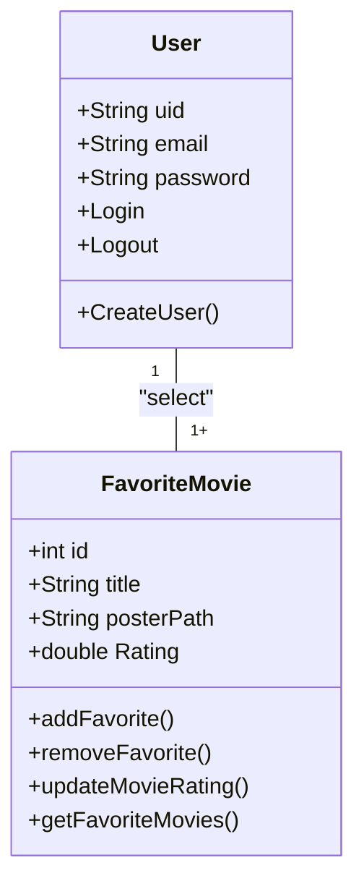
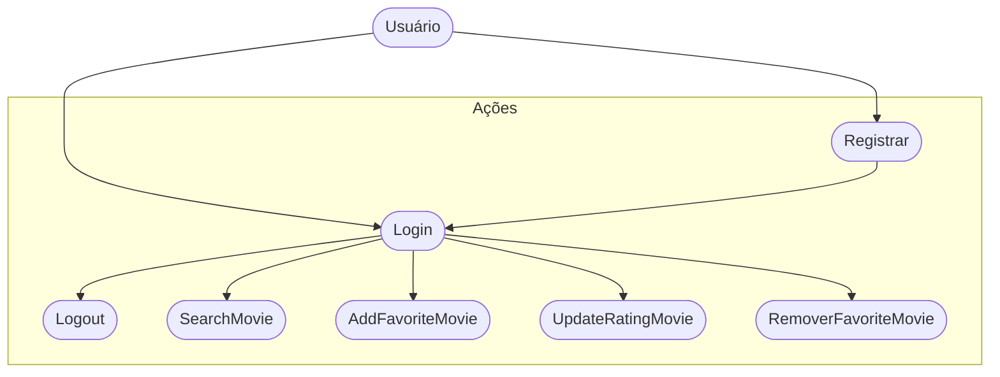

# Cine Favorite (Formativa)
Contruir um Aplicativo do Zero - O CineFavorite que permitirá criar uma conta e buscar filmes em uma API e montar uma galeria pessoal de filmes favoritos, com poster e nota avaliativa do usuário par o filme.

## Objetivos
- Criar uma Galeria Personalizada por Usuário de Filmes Favoritos
- Conectar o app com uma API(base de dados) de Filmes(TMDE)
- Permitir a criação de contas para cada usuário
- Listar Filmes por palavras chaves

## Levantamento de Requisitos do Projeto

- # Funcionais

- # Não Funcionais

## Recursos do Projeto

- Linguagem de Programação: Flutter/Dart
- API TMDB: Base de dados para Filmes
- Firebase: Authentication / FireStore
- Figma: criação do protótipo
- VSCode
- GitHub

## Diagramas

1. *Diagrama de Classes*

- Usuário (User)
    - Atributos: Email, Senha, Ui.d
    - Métodos: Login, Registrar, Logout

- Filmes Favoritos (FavoriteMovie): classe modelada pelo Dev
    - Atributos: Id, Título, PosterPath, Nota
    - Métodos: Adicionar, Remover, Listar, AtualizarNota (CRUD)

2. *Diagrama Caso de Uso*
Ação que os Atores odem fazer

- Usuário (User):
    - Registrar
    - Login
    - Logout
    - Procurar filmes na API
    - Salvar Filmes aos Favoritos
    - Dar Nota aos Filmes Favoritos
    - Remover Filme dos Favoritos

3. *Diagrama de Fluxo*